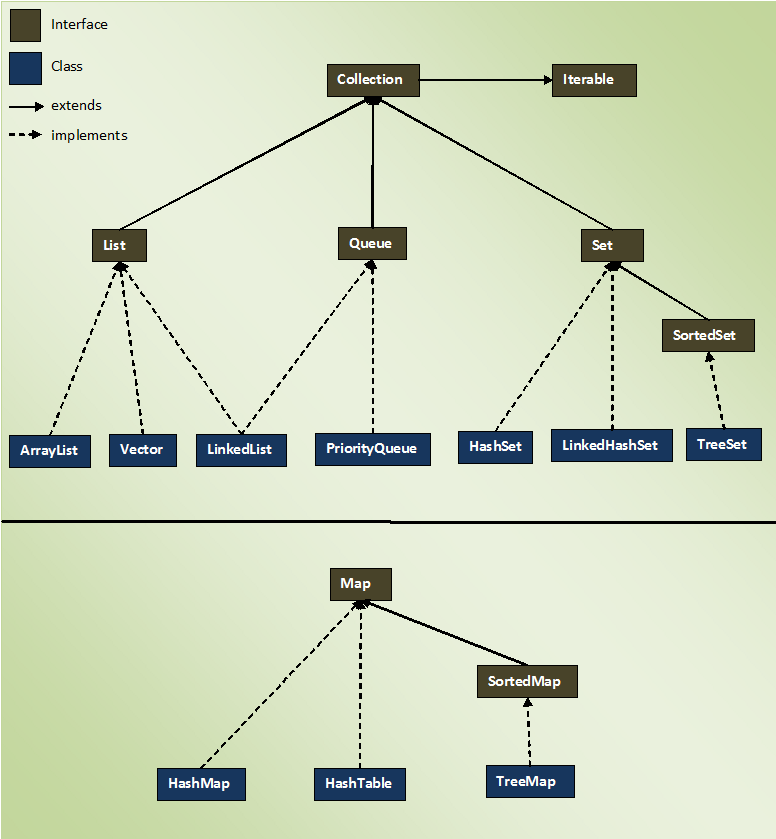

# Collections

Collections are objects that represent a group of objects (like Vector), while the Collections Framework can represent
and manipulate collections.
The Java Collections Framework is a unified architecture for representing and manipulating collections. It contains
interfaces, their implementation classes, and algorithms to process the data stored in a collection. The Collection
interface is extended by other interfaces like List, Set, and Queue.

- The Collections Framework is an interface, while Collections is a class.
- The Collection interface gives the standard functionality of data structures to List, Set, and Queue.
- The Collections class provides standard methods that you can use to search, sort, and coordinate collection elements.

**Note**: There's also a Map interface, but it doesn't implement the Collection interface because it stores key-value
pairs, and the classes that come under the Collection interface only store values.

## Framework

A framework is a set of classes and interfaces which provide a ready-made architecture. In order to implement a new
feature or a class, there is no need to define a framework. However, an optimal object-oriented design always includes a
framework with a collection of classes such that all the classes perform the same kind of task.

## The Java Collections Framework components

### Interfaces

These interfaces supply the abstract data type to represent the collection. The java.util.Collection is the root
interface of the framework. It's at the top of the framework hierarchy and contains important methods, like size(),
iterator(), add(), remove(), and clear().
The iterable interface is the root of the whole collection framework. It allows the iterator to iterate through all
collections. All classes and interfaces use this interface. The collection interface extends the iterable interface
and is executed by the classes in the collection framework. The list interface inhibits a list type data structure where
we can store ordered collections of objects.
Some more important interfaces include:

- List interface: java.util.List
- Set interface: java.util.Set
- Queue interface: java.util.Queue
- Map interface: java.util.Map

**Note**: The Map interface is the only one that doesn't inherit from the Collection interface, but is included in the
Collections Framework. All framework interfaces are in the java.util package.

### Implementation classes

The framework provides implementation classes for collections. You can use them to create different types of collections
in your Java programs. Some the main collection classes include:

- ArrayList
- LinkedList
- PriorityQueue
- HashMap and HashSet
- TreeMap and TreeSet

### Algorithms

The Collections framework defines several algorithms that can be applied to collections and maps. These algorithms are
defined as static methods within the Collections class. These algorithms perform important functions on collections,
like sorting lists.

## Advantages of the Collection Framework

- Consistent API: The API has a basic set of interfaces like Collection, Set, List, or Map, all the classes (ArrayList,
  LinkedList, Vector, etc.) that implement these interfaces have some common set of methods.
- Reduces programming effort: A programmer doesn't have to worry about the design of the Collection but rather he can
  focus on its best use in his program. Therefore, the basic concept of Object-oriented programming (i.e.) abstraction
  has been successfully implemented.
- Increases program speed and quality: Increases performance by providing high-performance implementations of useful
  data structures and algorithms because in this case, the programmer need not think of the best implementation of a
  specific data structure. He can simply use the best implementation to drastically boost the performance of his
  algorithm/program.

## The Collections Framework hierarchy

### List

#### ArrayList

ArrayList is the most commonly used implementation of the List interface. Some of its features include:

- Stores elements in insertion order.
- Allows for storage of duplicate elements.
- Supports null elements.
- Allows random access because array works at the index basis.
- Manipulation is little bit slower than the LinkedList in Java because a lot of shifting needs to occur if any element
  is removed from the array list.

An ArrayList stores data in a resizable array. When you create an ArrayList, you create an array of size zero. When the
first element is inserted, the array size changes to ten. This is known as lazy initialization, it saves a lot of
memory. Before adding an element to an ArrayList, the capacity is checked. If the array is full, then a new array of
size (n + n/2 + 1) is created. The elements from the old array are then copied to the new one.
There are three ways to create an ArrayList in Java:

- The no-arg constructor
- The constructor that takes initial capacity
- Existing Collection - You can create an ArrayList using an existing Collection, and the list will contain all the
  elements in the original collection in the same order.

There are many things you can do with an ArrayList, including:

- Update an element using the set(int index, E e) method
- Check if an element is present using the contains(Object o) method
- Remove all elements within a given Collection using the removeAll(Collection<?> c) method
- Replace all elements using the replaceAll(UnaryOperator<E> operator)

#### LinkedList

The LinkedList class implements the List and Deque interfaces. Some of its features include:

- Stores elements in insertion order
- Supports duplicate elements
- Allows any number of null elements

LinkedList also has a static inner class called Node, which contains three fields:

- item: contains the value of the current element
- next: contains the pointer to the next element
- prev: contains the pointer to the previous element

When an element is added to a LinkedList, it creates a new Node instance. The prev and next fields are set depending on
where the new node is added (doubly linked list).
There are two ways to create a LinkedList in Java:

- The no-arg constructor
- Existing Collection - You can create a LinkedList using an existing Collection, and the list will contain all the
  elements in the original collection in the same order.

Some more things you can do with LinkedList:

- Fetch an element at a particular index using the get(int index) method
- Remove the last element using the removeLast() method
- Sort a LinkedList using the sort() method

#### Difference between ArrayList and LinkedList

ArrayList and LinkedList both implements List interface and maintains insertion order. Both are non synchronized
classes. However, there are many differences between ArrayList and LinkedList classes that are given below.

| ArrayList                                                                                                                                              | LinkedList                                                                                                                            |
|--------------------------------------------------------------------------------------------------------------------------------------------------------|---------------------------------------------------------------------------------------------------------------------------------------|
| ArrayList internally uses a dynamic array to store the elements.                                                                                       | LinkedList internally uses a doubly linked list to store the elements.                                                                |
| Manipulation with ArrayList is slow because it internally uses an array. If any element is removed from the array, all the bits are shifted in memory. | Manipulation with LinkedList is faster than ArrayList because it uses a doubly linked list, so no bit shifting is required in memory. |
| An ArrayList class can act as a list only because it implements List only.                                                                             | LinkedList class can act as a list and queue both because it implements List and Queue interfaces.                                    |
| ArrayList is better for storing and accessing data.                                                                                                    | LinkedList is better for manipulating data.                                                                                           |

#### ArrayList Vs Vector

- Synchronization: ArrayList is non-synchronized which means multiple threads can work on ArrayList at the same time.
  For e.g. if one thread is performing an add operation on ArrayList, there can be an another thread performing remove
  operation on ArrayList at the same time in a multithreaded environment, while Vector is synchronized. This means if
  one thread is working on Vector, no other thread can get a hold of it. Unlike ArrayList, only one thread can perform
  an operation on vector at a time.
- Resize: Both ArrayList and Vector can grow and shrink dynamically to maintain the optimal use of storage, however the
  way they resized is different. ArrayList grow by half of its size when resized while Vector doubles the size of itself
  by default when grows.
- Performance: ArrayList gives better performance as it is non-synchronized. Vector operations gives poor performance as
  they are thread-safe, the thread which works on Vector gets a lock on it which makes other thread wait till the lock
  is released.
- fail-fast: First let me explain what is fail-fast: If the collection (ArrayList, vector etc) gets structurally
  modified by any means, except the add or remove methods of iterator, after creation of iterator then the iterator will
  throw ConcurrentModificationException. Structural modification refers to the addition or deletion of elements from the
  collection. As per the Vector javadoc the Enumeration returned by Vector is not fail-fast. On the other side the
  iterator and listIterator returned by ArrayList are fail-fast.
- Who belongs to collection framework really? The vector was not the part of collection framework, it has been included
  in collections later. It can be considered as Legacy code. There is nothing about Vector which List collection cannot
  do. Therefore Vector should be avoided. If there is a need of thread-safe operation make ArrayList synchronized or use
  CopyOnWriteArrayList which is a thread-safe variant of ArrayList.

There are few similarities between these classes which are as follows:

- Both Vector and ArrayList use growable array data structure.
- The iterator and listIterator returned by these classes (Vector and ArrayList) are fail-fast.
- They both are ordered collection classes as they maintain the elements insertion order.
- Vector & ArrayList both allows duplicate and null values.
- They both grows and shrinks automatically when overflow and deletion happens.

When to use ArrayList and when to use vector?

It totally depends on the requirement. If there is a need to perform “thread-safe” operation the vector is your best bet
as it ensures that only one thread access the collection at a time.

Performance: Synchronized operations consumes more time compared to non-synchronized ones so if there is no need for
thread safe operation, ArrayList is a better choice as performance will be improved because of the concurrent processes.

### Set

#### HashSet

HashSet is a class in the java.util package which implements the Set interface. Some of the features of the HashSet
include:

- Doesn't allow duplicate elements
- Only allows one null element
- Elements are inserted in a random order
- Internally backed by a HashMap

There are four ways to create a HashSet in Java:

- The no-arg constructor - This will create a HashSet with an initial capacity of 16 and a load factor of 0.75. The load
  factor is a measure of how full the HashSet is allowed to get before its capacity is automatically increased.
- A constructor that takes initial capacity - If you know your HashSet will have more than 16 elements, you can set a
  higher initial capacity to reduce the need for resizing. It will use a default load factor of 0.75.
- A constructor that takes initial capacity and load factor - You can also provide an initial load factor along with an
  initial capacity.
- A constructor that takes another Set as a parameter - You can create a HashSet using another Set by passing it to the
  constructor. It will have the same size as the passed set and a default load factor of 0.75.

The add(E e) method inserts an element into the HashSet. If the inserted element wasn’t already in the HashSet, the
method returned true. If the element was already in the HashSet, the method returned false.

There’s more you can do with HashSets, like:

- Remove elements using the remove(Object o) method
- Check if the HashSet is empty using the isEmpty() method
- Fetch an element from a HashSet using the contains() method

#### LinkedHashSet

Java LinkedHashSet class is a Hashtable and Linked list implementation of the set interface. It inherits HashSet class
and implements Set interface.

The important points about Java LinkedHashSet class are:

- contains unique elements only like HashSet.
- provides all optional set operation and permits null elements.
- is non synchronized.
- maintains insertion order.

The LinkedHashSet class extends HashSet class which implements Set interface. The Set interface inherits Collection and
Iterable interfaces in hierarchical order.

Constructors:

- The no-arg constructor - It is used to construct a default HashSet.
- Existing Collection - It is used to initialize the hash set by using the elements of the collection c.
- The constructor that takes initial capacity - It is used initialize the capacity of the linked hash set to the given
  integer value capacity.
- The constructor that takes initial capacity and fill ratio - It is used to initialize both the capacity and the fill
  ratio (also called load capacity) of the hash set from its argument.

#### TreeSet

The TreSet class implements the Set interface that uses a tree for storage. Some features include:

- Doesn't allow duplicate elements
- Doesn't allow null elements
- Quick access and retrieval times
- Elements stored in ascending order

How is a TreeSet different from a HashSet:

- HashSet allows one null element, while TreeSet doesn't allow any
- Elements are sorted randomly in HashSet, while they are sorted in order in TreeSet
- HashSet is faster for operations like add, remove, contains, size, etc.

There are four ways to create a TreeSet in Java:

- The no-arg constructor
- A constructor with Comparator as an argument - If the objects you store in your TreeSet don’t implement the Comparator
  interface or if you need to store the elements in descending order, you can provide a custom Comparator while creating
  a TreeSet, which will sort the elements per the logic of the Comparator.
- A constructor with the Collection type argument - You can create a TreeSet from another Collection. The elements will
  be stored in ascending order.
- A constructor with the argument of type SortedSet - This constructor acts as a copy constructor and creates a new
  sorted set with the same elements and the same order of the provided sorted set.

There are more things you can do with TreeSet, such as:

- Fetch elements greater than the given element using the tailSet(E fromElement) method
- Fetch a subset of elements using the subSet(E fromElement, E to Element) method

### Difference between List and Set

List and Set both are interfaces. They both extend Collection interface.

- List is an ordered collection it maintains the insertion order, which means upon displaying the list content it will
  display the elements in the same order in which they got inserted into the list.
- Set is an unordered collection, it doesn't maintain any order. There are few implementations of Set which maintains
  the order such as LinkedHashSet (It maintains the elements in insertion order).
- List allows duplicates while Set doesn't allow duplicate elements. All the elements of a Set should be unique if you
  try to insert the duplicate element in Set it would replace the existing value.
- List allows any number of null values. Set can have only a single null value at most.
- ListIterator can be used to traverse a List in both the directions(forward and backward) However it can not be used to
  traverse a Set. We can use Iterator (It works with List too) to traverse a Set.
- List interface has one legacy class called Vector whereas Set interface does not have any legacy class.

The usage is purely depends on the requirement:

- If the requirement is to have only unique values then Set is your best bet as any implementation of Set maintains
  unique values only.
- If there is a need to maintain the insertion order irrespective of the duplicity then List is the best option. Both
  the implementations of List interface – ArrayList and LinkedList sorts the elements in their insertion order.

### Map

A Map is an object that maps keys with values. A map cannot contain duplicate keys. There are three main implementations
of Map interface: HashMap, TreeMap, and LinkedHashMap.

- HashMap: it makes no guarantees concerning the order of iteration
- TreeMap: It stores its elements in a red-black tree, orders its elements based on their values; it is substantially
  slower than HashMap.
- LinkedHashMap: It orders its elements based on the order in which they were inserted into the set (insertion-order).

#### HashMap

HashMap is a Map based collection class that is used for storing Key & value pairs, it is denoted as HashMap<Key, Value>
or HashMap<K, V>. This class makes no guarantees as to the order of the map. It is similar to the Hashtable class except
that it is not synchronized and permits nulls(null values and null key).

It is not an ordered collection which means it does not return the keys and values in the same order in which they have
been inserted into the HashMap. It does not sort the stored keys and Values. You must need to import java.util.HashMap
or its super class in order to use the HashMap class and methods.

Here is the list of methods available in HashMap class:

- void clear(): It removes all the key and value pairs from the specified Map.
- Object clone(): It returns a copy of all the mappings of a map and used for cloning them into another map.
- boolean containsKey(Object key): It is a boolean function which returns true or false based on whether the specified
  key is found in the map.
- boolean containsValue(Object Value): Similar to containsKey() method, however it looks for the specified value instead
  of key.
- Value get(Object key): It returns the value for the specified key.
- boolean isEmpty(): It checks whether the map is empty. If there are no key-value mapping present in the map then this
  function returns true else false.
- Set keySet(): It returns the Set of the keys fetched from the map.
- Value put(Key k, Value v): Inserts key value mapping into the map. Used in the above example.
- int size(): Returns the size of the map – Number of key-value mappings.
- Collection values(): It returns a collection of values of map.
- Value remove(Object key): It removes the key-value pair for the specified key. Used in the above example.
- void putAll(Map m): Copies all the elements of a map to the another specified map.

#### LinkedHashMap

LinkedHashMap is a Hash table and linked list implementation of the Map interface, with predictable iteration order.
This implementation differs from HashMap in that it maintains a doubly-linked list running through all of its entries.
This linked list defines the iteration ordering, which is normally the order in which keys were inserted into the map (
insertion-order).

#### TreeMap

The TreeMap in Java is used to implement Map interface and NavigableMap along with the AbstractMap Class. The map is
sorted according to the natural ordering of its keys, or by a Comparator provided at map creation time, depending on
which constructor is used. This proves to be an efficient way of sorting and storing the key-value pairs. The storing
order maintained by the treemap must be consistent with equals just like any other sorted map, irrespective of the
explicit comparators. The treemap implementation is not synchronized in the sense that if a map is accessed by multiple
threads, concurrently and at least one of the threads modifies the map structurally, it must be synchronized externally.

#### Hashtable

This class implements a hash table, which maps keys with values. Any non-null object can be used as a key or as a value.
Hashtable is similar to HashMap except it is synchronized.

