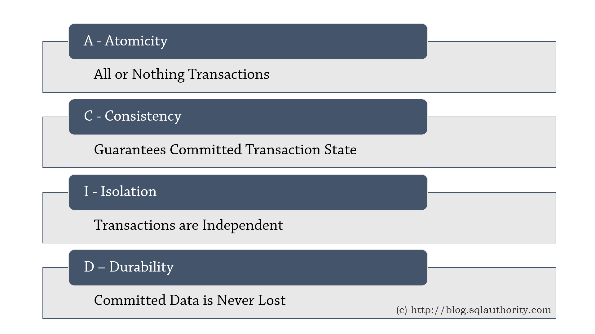

# SQL

SQL (Structured Query Language) is a standardized programming language that's used to manage relational databases and
perform various operations on the data in them. Initially created in the 1970s, SQL is regularly used not only by
database administrators, but also by developers writing data integration scripts and data analysts looking to set up and
run analytical queries.

The uses of SQL include modifying database table and index structures; adding, updating and deleting rows of data; and
retrieving subsets of information from within a database for transaction processing and analytics applications. Queries
and other SQL operations take the form of commands written as statements -- commonly used SQL statements include select,
add, insert, update, delete, create, alter and truncate.

## ACID

A transaction is a sequence of operations performed (using one or more SQL statements) on a database as a single logical
unit of work. The effects of all the SQL statements in a transaction can be either all committed (applied to the
database) or all rolled back (undone from the database). A database transaction must be atomic, consistent, isolated,
and durable.

## normalizations

It is the processes of reducing the redundancy of data in the table and also improving the data integrity. So why is
this required? without Normalization in SQL, we may face many issues such as

- Insertion anomaly: It occurs when we cannot insert data to the table without the presence of another attribute
- Update anomaly: It is a data inconsistency that results from data redundancy and a partial update of data.
- Deletion Anomaly: It occurs when certain attributes are lost because of the deletion of other attributes.

In brief, normalization is a way of organizing the data in the database. Normalization entails organizing the columns
and tables of a database to ensure that their dependencies are properly enforced by database integrity constraints.

## isolation levels

As we know, in order to maintain consistency in a database, it follows ACID properties. Among these four properties (
Atomicity, Consistency, Isolation, and Durability) Isolation determines how transaction integrity is visible to other
users and systems. It means that a transaction should take place in a system in such a way that it is the only
transaction that is accessing the resources in a database system.

Isolation levels define the degree to which a transaction must be isolated from the data modifications made by any other
transaction in the database system. A transaction isolation level is defined by the following phenomena:

- Dirty Read – A Dirty read is the situation when a transaction reads data that has not yet been committed. For example,
  Let’s say transaction 1 updates a row and leaves it uncommitted, meanwhile, Transaction 2 reads the updated row. If
  transaction 1 rolls back the change, transaction 2 will have read data that is considered never to have existed.
- Non Repeatable read – Non Repeatable read occurs when a transaction reads the same row twice and gets a different
  value each time. For example, suppose transaction T1 reads data. Due to concurrency, another transaction T2 updates
  the same data and commits, Now if transaction T1 rereads the same data, it will retrieve a different value.
- Phantom Read – Phantom Read occurs when two same queries are executed, but the rows retrieved by the two, are
  different. For example, suppose transaction T1 retrieves a set of rows that satisfy some search criteria. Now,
  Transaction T2 generates some new rows that match the search criteria for transaction T1. If transaction T1
  re-executes the statement that reads the rows, it gets a different set of rows this time.

Based on these phenomena, The SQL standard defines four isolation levels:

- Read Uncommitted – Read Uncommitted is the lowest isolation level. In this level, one transaction may read not yet
  committed changes made by another transaction, thereby allowing dirty reads. At this level, transactions are not
  isolated from each other.
- Read Committed – This isolation level guarantees that any data read is committed at the moment it is read. Thus it
  does not allows dirty reading. The transaction holds a read or write lock on the current row, and thus prevents other
  transactions from reading, updating, or deleting it.
- Repeatable Read – This is the most restrictive isolation level. The transaction holds read locks on all rows it
  references and writes locks on all rows it inserts, updates, or deletes. Since other transactions cannot read, update
  or delete these rows, consequently it avoids non-repeatable read.
- Serializable – This is the highest isolation level. A serializable execution is guaranteed to be serializable.
  Serializable execution is defined to be an execution of operations in which concurrently executing transactions appear
  to be serially executing.

## types of joins

There are different types of joins available in SQL:

- INNER JOIN − returns rows when there is a match in both tables.
- LEFT JOIN − returns all rows from the left table, even if there are no matches in the right table.
- RIGHT JOIN − returns all rows from the right table, even if there are no matches in the left table.
- FULL JOIN − returns rows when there is a match in one of the tables.
- SELF JOIN − is used to join a table to itself as if the table were two tables, temporarily renaming at least one table
  in the SQL statement.
- CARTESIAN JOIN − returns the Cartesian product of the sets of records from the two or more joined tables.

## indexes

Indexes are special lookup tables that the database search engine can use to speed up data retrieval. Simply put, an
index is a pointer to data in a table. An index in a database is very similar to an index in the back of a book.

For example, if you want to reference all pages in a book that discusses a certain topic, you first refer to the index,
which lists all the topics alphabetically and are then referred to one or more specific page numbers.

An index helps to speed up SELECT queries and WHERE clauses, but it slows down data input, with the UPDATE and the
INSERT statements. Indexes can be created or dropped with no effect on the data.

Creating an index involves the CREATE INDEX statement, which allows you to name the index, to specify the table and
which column or columns to index, and to indicate whether the index is in an ascending or descending order.

Indexes can also be unique, like the UNIQUE constraint, in that the index prevents duplicate entries in the column or
combination of columns on which there is an index.

## aggregate functions

An aggregate function allows you to perform a calculation on a set of values to return a single scalar value. We often
use aggregate functions with the GROUP BY and HAVING clauses of the SELECT statement.

The following are the most commonly used SQL aggregate functions:

- AVG – calculates the average of a set of values.
- COUNT – counts rows in a specified table or view.
- MIN – gets the minimum value in a set of values.
- MAX – gets the maximum value in a set of values.
- SUM – calculates the sum of values.

Notice that all aggregate functions above ignore NULL values except for the COUNT function.

## data types

## pessimistic and optimistic locking

Optimistic Locking is a strategy where you read a record, take note of a version number (other methods to do this
involve dates, timestamps or checksums/hashes) and check that the version hasn't changed before you write the record
back. When you write the record back you filter the update on the version to make sure it's atomic. (i.e. hasn't been
updated between when you check the version and write the record to the disk) and update the version in one hit.

If the record is dirty (i.e. different version to yours) you abort the transaction and the user can re-start it.

This strategy is most applicable to high-volume systems and three-tier architectures where you do not necessarily
maintain a connection to the database for your session. In this situation the client cannot actually maintain database
locks as the connections are taken from a pool and you may not be using the same connection from one access to the next.

Pessimistic Locking is when you lock the record for your exclusive use until you have finished with it. It has much
better integrity than optimistic locking but requires you to be careful with your application design to avoid Deadlocks.
To use pessimistic locking you need either a direct connection to the database (as would typically be the case in a two
tier client server application) or an externally available transaction ID that can be used independently of the
connection.

In the latter case you open the transaction with the TxID and then reconnect using that ID. The DBMS maintains the locks
and allows you to pick the session back up through the TxID. This is how distributed transactions using two-phase commit
protocols (such as XA or COM+ Transactions) work.
